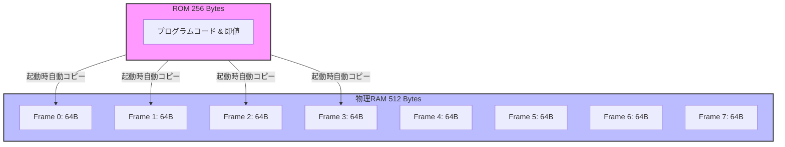
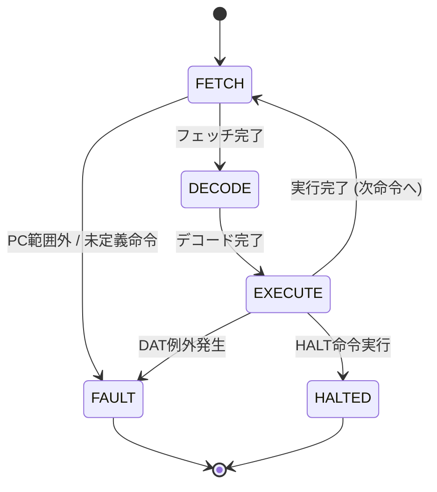

# 8ビット仮想記憶CPU 仕様書 (CPU Architecture & Instruction Set Specification)

このドキュメントでは、本エミュレーターで再現されている簡略化された8ビットCPUのアーキテクチャ、メモリ構造、動的アドレス変換（DAT）システム、および命令セットについて詳しく解説します。

---

## 1. 基本アーキテクチャ概要 (CPU Architecture)

本CPUは、学習およびデモ用に設計されたシンプルな**8ビットCPU**です。基本的な演算から、仮想記憶（ページング）のような高度なメモリ管理機能までを非常にコンパクトに再現しています。

### 1.1 レジスタ構成

CPUは以下のレジスタおよびフラグを保持しています。すべて8ビット幅を基本としています。

| レジスタ / フラグ名 | ビット幅 | 説明 |
| :--- | :--- | :--- |
| **R0 〜 R7** | 8-bit × 8 | 汎用レジスタ。データ演算やアドレス指針として自由に使用できます。 |
| **PC (Program Counter)** | 8-bit | プログラムカウンタ。次に実行する命令の**仮想アドレス**を指します。 |
| **DATR (DAT Control Register)** | 8-bit | DAT（動的アドレス変換）制御レジスタ。下位1ビットが有効フラグ（`1`:有効, `0`:無効）です。 |
| **CR1 (Control Register 1)** | 8-bit | コントロールレジスタ1 (PASCE: Primary Address-Space-Control Element)。DAT有効時に使用する**ページテーブルの物理フレーム番号 (0〜7)** を保持します。 |
| **ZF (Zero Flag)** | 1-bit | ゼロフラグ。`CMP`命令による比較結果が「一致（等しい）」した場合に `true` になります。 |
| **EF (Error Flag)** | 1-bit | エラーフラグ（例外フラグ）。未定義命令の実行、PCの範囲外（256バイト以上）への逸脱、または**DAT変換例外（ページフォルト等）**が発生した場合に `true` となり、CPUを異常停止させます。 |
| **Halted** | 1-bit | 実行停止フラグ。`HALT`命令を実行すると `true` になり、CPUは正常に停止します。 |

---

## 2. メモリ構成 (Memory Structure)

### 2.1 ROM (Read-Only Memory)
* **容量**: 256バイト（アドレス: `0x00` 〜 `0xFF`）
* **役割**: 初期プログラムコードおよび定数値が格納される読み出し専用領域です。起動時に物理RAMへプログラムをプリロードするために使用されます。

### 2.2 RAM (Random Access Memory)
* **容量**: 512バイト（物理アドレス: `0x000` 〜 `0x1FF`）
* **役割**: プログラムの実行コード格納、および実行中のデータ読み書きに使用される主記憶領域です。
* **物理フレーム構造**:
  * 物理RAMは、**64バイト単位の「フレーム（Frame）」8個**（フレーム0〜7）に分割して管理されます。

### 2.3 起動（初期化）時の挙動
本エミュレーターの起動時、**ROMデータ（256バイト）が物理RAMの先頭アドレス（`0x000`〜`0x0FF`、すなわちフレーム0〜3）に自動的にコピー（プレロード）**されます。これにより、初期状態ではRAMの先頭に最初のプログラムが展開された状態（かつDAT無効状態）から実行が始まります。

### 2.4 命令フェッチの仕様
本CPUの**命令フェッチ（FETCH）は常に物理RAMから、かつ動的アドレス変換（DAT）を介して**行われます。
* **DAT無効時**: `PC`（プログラムカウンタ）の指す仮想アドレスがそのまま物理RAMの先頭256バイト（`0x000`〜`0x0FF`）にストレートマップされてフェッチされます。
* **DAT有効時**: `CR1`（PASCE）が指し示す物理フレーム内のページテーブルを介して `PC` の仮想アドレスが物理アドレスへと動的に変換され、該当する物理RAMフレームから命令がフェッチされます。
* **メリット**: これにより、全く同じ仮想アドレス `0x00` から開始する別のプログラムコードを物理メモリの異なるフレームに配置し、`CR1` を切り替えるだけでそれぞれを並走実行する（真のマルチタスク）ことが可能になります。

---




## 3. 動的アドレス変換システム (DAT: Dynamic Address Translation)

本CPUの最大の特徴は、非常にシンプルな**動的アドレス変換（仮想記憶）システム**がハードウェアレベルで再現されている点です。これにより、8ビットの仮想アドレス空間（256バイト）から、9ビットの物理アドレス空間（512バイト）へのマッピングを行うことができます。

### 3.1 ページとフレームの設計

仮想アドレス空間と物理アドレス空間は、**64バイト（ページサイズ）**を基準に分割されています。

* **ページサイズ (Page Size)**: **64バイト** ($2^6$ バイト)
  * アドレスの下位6ビット（ビット5〜0）が**ページ内オフセット（Offset）**となります。
* **仮想ページ (Virtual Page)**: **4枚** (仮想ページ0〜3)
  * 8ビット仮想アドレスの上位2ビット（ビット7〜6）が**仮想ページ番号（VPN: Virtual Page Number）**となります。
  * 仮想アドレス空間の合計: $4 \text{ ページ} \times 64 \text{ バイト} = 256 \text{ バイト}$
* **物理フレーム (Physical Frame)**: **8枚** (物理フレーム0〜7)
  * 9ビット物理アドレスの上位3ビット（ビット8〜6）が**物理フレーム番号（PFN: Physical Frame Number）**となります。
  * 物理アドレス空間の合計: $8 \text{ フレーム} \times 64 \text{ バイト} = 512 \text{ バイト}$

```
仮想アドレス (8-bit)
+-------------+-----------------------------+
|  VPN (2bit) |        Offset (6bit)        |
+-------------+-----------------------------+
 7           6 5                           0

物理アドレス (9-bit)
+---------------+-----------------------------+
|   PFN (3bit)  |        Offset (6bit)        |
+---------------+-----------------------------+
 8             6 5                           0
```

### 3.2 アドレス変換モード

メモリアクセス（`LOAD` / `STORE`）の実行時、`DATR`（DAT制御レジスタ）の値によってアドレス変換の挙動が変わります。

#### A. DAT無効モード (`DATR` 下位1bit = `0`)
* 仮想アドレス（8ビット）が、物理アドレスの下位8ビットへそのままマッピング（ストレートマッピング）されます。
* 物理アドレスの上位1ビットは常に `0` となるため、物理アドレスの範囲は `0x000` 〜 `0x0FF` （物理フレーム0〜3）に制限されます。物理RAMの後半（物理フレーム4〜7、`0x100`〜`0x1FF`）へのアクセスはできません。

#### B. DAT有効モード (`DATR` 下位1bit = `1`)
* 仮想アドレスから物理アドレスへの変換が、**物理RAM上のページテーブル**を介して動的に行われます。
* **物理ページテーブルの配置**:
  - ページテーブルは、コントロールレジスタ **`CR1` (PASCE)** が指し示す物理フレーム（64バイト）の先頭4バイト領域に配置されます。
  - 仮想ページ0〜3に対応する4つのエントリを持ち、それぞれ1バイトで表現されます。
  - **ページテーブルエントリの構造 (1バイト)**:
    - **ビット7 (`V`)**: Validフラグ（`1`: マッピング有効, `0`: マッピング無効/ページフォルト）
    - **ビット2〜0 (`PFN`)**: 変換先のマッピング先物理フレーム番号 (0〜7)
    - ※ 他のビットは `0` (予約/未使用)。
* **変換手順**:
  1. 仮想アドレスから `VPN`（上位2ビット）と `Offset`（下位6ビット）を抽出します。
  2. 物理RAMのアドレス `(CR1 << 6) + VPN` からページテーブルエントリ（1バイト）を読み出します。
  3. `V` (ビット7) が `1` の場合：
     * 物理アドレス ＝ `(PFN << 6) | Offset` として合成され、物理RAMのデータへアクセスします。
  4. `V` (ビット7) が `0` の場合：
     * **DAT変換例外（アドレス翻訳エラー/ページフォルト）**が発生します。CPUの `EF`（エラーフラグ）が `true` になり、実行は強制停止（`FAULT`状態）します。

---

## 4. CPUの実行サイクル (Execution Phases)

本CPUは、1つの命令を以下の**3つのフェーズ**に分けて段階的に実行します。エミュレーター上では、1クロック進めるごとにこれらのフェーズを遷移します。



### 4.1 FETCH (フェッチ)
1. 現在の `PC` が指すROMの番地からオペコード（1バイト目）を読み取ります。
2. その命令に必要なサイズ（1〜3バイト）分をROMからフェッチバッファ（`fetchBuffer`）に一括して読み込みます。
3. フェッチ完了時点で `PC` を `PC + 命令のバイト数` (8ビットマスク) に更新し、次に実行する命令の先頭を指すようにします（現実のCPUと同様に、命令の取り出し完了とともにPCが進みます）。
4. フェーズを `DECODE` に移行します。
* *例外*: `PC` が256以上を指していた場合、またはオペコードが定義されていない場合は `EF = true` となり、`FAULT` 状態へ移行します。

### 4.2 DECODE (デコード)
1. `fetchBuffer` に格納されたデータから、命令の定義に従ってオペランド（引数）を解析します。
2. レジスタ番号、即値（定数）、メモリ仮想アドレスなどを抽出し、人間用の説明テキスト（アセンブリ表現）を生成して内部状態にセットします。
3. フェーズを `EXECUTE` に移行します。

### 4.3 EXECUTE (実行)
1. デコードされたオペランド情報に基づき、実際の処理（演算、レジスタ書き換え、メモリアクセスなど）を実行します。
2. メモリアクセス（データのロード・ストア）を伴う命令では、**動的アドレス変換（DAT）**を介して物理RAMの読み書きを行います。
3. `PC` は既にFETCHフェーズで次の命令の先頭へ進んでいます。分岐命令の場合のみ、ここで `PC` を分岐先の絶対アドレスに上書きします。
4. 実行後のCPU状態に応じて、次のフェーズを選択します：
   * DAT例外等のエラーが発生した場合 ➜ `FAULT` 状態へ
   * `HALT` 命令を実行した場合 ➜ `HALTED` 状態へ
   * 正常終了した場合 ➜ `FETCH` フェーズに戻り、次の命令へ

---

## 5. 命令セット詳細 (Instruction Set)

本CPUは合計20種類の命令をサポートしています。

### 5.1 命令一覧

| Opcode | Mnemonic | バイト数 | オペランドタイプ | 説明 |
| :--- | :--- | :---: | :--- | :--- |
| **0x01** | `ADD rd, rs` | 2 | `reg_reg` | `R[rd] = (R[rd] + R[rs]) & 0xFF` |
| **0x02** | `ADD rd, imm` | 3 | `reg_imm` | `R[rd] = (R[rd] + imm) & 0xFF` |
| **0x03** | `SUB rd, rs` | 2 | `reg_reg` | `R[rd] = (R[rd] - R[rs] + 256) & 0xFF` |
| **0x04** | `SUB rd, imm` | 3 | `reg_imm` | `R[rd] = (R[rd] - imm + 256) & 0xFF` |
| **0x05** | `CMP ra, rb` | 2 | `reg_reg` | `ZF = (R[ra] == R[rb])` (等しければZF=1, 違えば0) |
| **0x06** | `CMP ra, imm` | 3 | `reg_imm` | `ZF = (R[ra] == imm)` (等しければZF=1, 違えば0) |
| **0x10** | `LOAD rd, imm` | 3 | `reg_imm` | `R[rd] = imm` (即値をレジスタにロード) |
| **0x11** | `LOAD rd, [addr]`| 3 | `reg_addr` | `R[rd] = Memory[addr]` (仮想アドレスからロード) |
| **0x12** | `LOAD rd, [ra]` | 2 | `reg_ind` | `R[rd] = Memory[R[ra]]` (レジスタ間接ロード) |
| **0x20** | `STORE [addr], rs`| 3 | `addr_reg` | `Memory[addr] = R[rs]` (仮想アドレスにストア) |
| **0x21** | `STORE [ra], rs` | 2 | `ind_reg` | `Memory[R[ra]] = R[rs]` (レジスタ間接ストア) |
| **0x30** | `BR addr` | 2 | `addr` | `PC = addr` (無条件分岐) |
| **0x31** | `BEQ addr` | 2 | `addr` | `if (ZF == 1) PC = addr` (一致時分岐) |
| **0x32** | `BNE addr` | 2 | `addr` | `if (ZF == 0) PC = addr` (不一致時分岐) |
| **0x33** | `BR rs` | 2 | `reg` | `PC = R[rs]` (レジスタ間接無条件分岐) |
| **0x34** | `BEQ rs` | 2 | `reg` | `if (ZF == 1) PC = R[rs]` (レジスタ間接一致時分岐) |
| **0x35** | `BNE rs` | 2 | `reg` | `if (ZF == 0) PC = R[rs]` (レジスタ間接不一致時分岐) |
| **0x40** | `DATSET pg, fr` | 2 | `page_frame` | `Memory[(CR1 << 6) + pg] = 0x80 | fr` (現在のCR1のページテーブルにマッピング登録) |
| **0x41** | `DATCLR pg` | 2 | `page` | `Memory[(CR1 << 6) + pg] = 0x00` (現在のCR1のページテーブルのマッピング解除) |
| **0x42** | `DATEN` | 1 | `none` | `DATR = 1` (動的アドレス変換を有効化) |
| **0x43** | `DATDIS` | 1 | `none` | `DATR = 0` (動的アドレス変換を無効化) |
| **0x44** | `LCTL CR1, rs` | 2 | `cr_reg` | `CR1 = R[rs] & 0x07` (コントロールレジスタCR1にページテーブルのフレーム番号をロード。OS特権命令) |
| **0xFF** | `HALT` | 1 | `none` | CPUの実行を正常終了して停止します。 |

---

### 5.2 バイナリエンコード形式

アセンブルされたマシン語（機械語）は以下のようにエンコードされ、ROMに配置されます。

#### 1. `reg_reg` タイプ (例: `ADD R1, R2` [Opcode 0x01])
* **1バイト目**: `0x01` (Opcode)
* **2バイト目**: `0x12` (上位4bit: `rd` = 1, 下位4bit: `rs` = 2)

#### 2. `reg_imm` タイプ (例: `LOAD R0, 42` [Opcode 0x10])
* **1バイト目**: `0x10` (Opcode)
* **2バイト目**: `0x00` (レジスタ `rd` のインデックス: 0)
* **3バイト目**: `0x2A` (即値 `imm` = 42)

#### 3. `reg_addr` タイプ (例: `LOAD R2, [0x80]` [Opcode 0x11])
* **1バイト目**: `0x11` (Opcode)
* **2バイト目**: `0x02` (レジスタ `rd` のインデックス: 2)
* **3バイト目**: `0x80` (仮想アドレス `addr` = 128)

#### 4. `addr_reg` タイプ (例: `STORE [0x80], R3` [Opcode 0x20])
* **1バイト目**: `0x20` (Opcode)
* **2バイト目**: `0x03` (レジスタ `rs` のインデックス: 3)
* **3バイト目**: `0x80` (仮想アドレス `addr` = 128)

#### 5. `reg_ind` / `ind_reg` タイプ (例: `STORE [R1], R0` [Opcode 0x21])
* **1バイト目**: `0x21` (Opcode)
* **2バイト目**: `0x10` (上位4bit: `ra` = 1, 下位4bit: `rs` = 0)

#### 6. `addr` タイプ (例: `BR 0x50` [Opcode 0x30])
* **1バイト目**: `0x30` (Opcode)
* **2バイト目**: `0x50` (仮想アドレス `addr` = 80)

#### 7. `page_frame` タイプ (例: `DATSET 1, 7` [Opcode 0x40])
* **1バイト目**: `0x40` (Opcode)
* **2バイト目**: `0x17` (上位4bit: `page` = 1, 下位4bit: `frame` = 7)

#### 8. `page` タイプ (例: `DATCLR 2` [Opcode 0x41])
* **1バイト目**: `0x41` (Opcode)
* **2バイト目**: `0x02` (対象の仮想ページ `page` = 2)

#### 9. `cr_reg` タイプ (例: `LCTL CR1, R2` [Opcode 0x44])
* **1バイト目**: `0x44` (Opcode)
* **2バイト目**: `0x02` (レジスタ `rs` のインデックス: 2)

#### 10. `reg` タイプ (例: `BR R4` [Opcode 0x33])
* **1バイト目**: `0x33` (Opcode)
* **2バイト目**: `0x04` (レジスタ `rs` のインデックス: 4)

---

## 6. アセンブラ仕様 (Assembler Specification)

本エミュレーターに搭載されているアセンブラは、テキスト形式のアセンブリソースコードをパースして256バイトのROMバイナリに変換します。

### 6.1 基本文法

1. **コメント**:
   * セミコロン `;` から行末まではコメントとして無視されます。
2. **ラベルの定義**:
   * 行頭に `ラベル名:` を記述することで、その位置のアドレスをラベルとして登録できます（例: `loop:`）。
   * `BR`, `BEQ`, `BNE` などの分岐命令のターゲットにラベル名を直接指定できます（アセンブル時に絶対アドレスに自動置換されます）。
   * ラベル名はメモリオペランド `[...]` の内側にも指定できます（例: `LOAD R0, [counter]`、`STORE [counter], R1`）。これにより、後述の `DS` 擬似命令で確保した変数を名前で読み書きできます。
3. **数値の表記**:
   * 10進数（例: `10`, `255`）のほか、頭に `0x` を付けることで16進数（例: `0x0A`, `0xFF`）も使用可能です。
4. **大文字・小文字の区別**:
   * 命令のニーモニック（`LOAD`, `add` など）やレジスタ名（`R0`, `r3` など）は大文字・小文字を区別しません。

### 6.2 DS擬似命令（変数・記憶領域の定義）

メモリ上に名前付きの記憶領域（変数）を**明示的に**確保するための擬似命令です。IBM HLASM の `DS` (Define Storage) に倣った設計で、「確保した領域のサイズだけ書き込み位置を進め、その先頭アドレスに名前（ラベル）を割り当てる」動作をします。確保した領域は**ゼロで初期化**されます（DS は本来「初期値を持たない記憶域の予約」であるため）。

#### 書式

```assembly
名前: DS [反復数]型[L長さ]
```

* **名前**: 確保領域の先頭アドレスに割り当てるラベル。他のラベルと同様に行頭へ `名前:`（コロン付き）で記述します（例: `counter: DS X`）。なお、ラベルは他の命令と同じく**独立した行に分けて記述しても構いません**。その場合、ラベル行はアドレスを進めないため、直後の `DS` 行がそのアドレスから領域を確保し、名前は確保領域の先頭を指します（下記参照）。

  ```assembly
  counter:
      DS X         ; 上の counter: DS X と等価
  ```
* **反復数 (duplication factor)**: 要素を何個分確保するか（省略時は `1`）。
* **型 (type)**: 要素の種類。本CPUは8ビット（バイト）マシンであるため、要素長1バイトの以下の型をサポートします。
  * `X` … 1バイト（16進/汎用バイト）
  * `C` … 1バイト（文字）
* **L長さ (length modifier)**: 1要素あたりのバイト長を明示的に指定します（省略時は型ごとの既定長＝1バイト）。

確保される合計バイト数は **反復数 × 1要素の長さ** です。

#### 配置位置について

`DS` は記述した位置にそのまま領域を確保します。命令コードと混在させると実行時にデータがコードとして実行されてしまうため、**通常は `HALT` の後など、命令の実行が到達しない位置にまとめて記述**してください。

#### 例

```assembly
counter: DS X        ; 1バイトの変数 counter
buf:     DS XL16     ; 16バイトのバッファ buf
table:   DS 8X       ; 1バイト × 8個 = 8バイトの配列 table
name:    DS CL8      ; 8バイトの文字領域 name

; ラベルを別行に分けて書く形式も可（上の各行と等価）
VARNAME:
         DS 8X       ; VARNAME は確保領域の先頭を指す。STORE [VARNAME], R0 / LOAD R1, [VARNAME] で読み書き可能
```

### 6.3 サンプルプログラム

#### サンプル 1: 基本的なDAT設定とメモリアクセス
以下は、初期状態（CR1=0、物理フレーム0のページテーブル領域を使用）においてDATを設定し、物理フレーム7（RAMのアドレス `0x1C0`）に対してデータを読み書きする実用的なサンプルプログラムです。

```assembly
; === DATの初期設定サンプル ===
DATSET 0, 7       ; 仮想ページ0 (0x00~0x3F) に 物理フレーム7 (RAM 0x1C0~0x1FF) をマッピング
DATEN             ; DATを有効化

LOAD R0, 42       ; 書き込むデータ (42) をR0にロード
STORE [0x05], R0  ; 仮想アドレス 0x05 (物理アドレス 0x1C5) に R0 の値を書き込む

LOAD R1, 0        ; R1をクリア
LOAD R1, [0x05]   ; 仮想アドレス 0x05 から R1 にロード (R1は 42 になる)

HALT              ; 実行を停止
```

#### サンプル 2: LCTL命令による真のコンテキストスイッチ (マルチアドレススペース)
以下は、物理RAM上に独立した2つのページテーブル（フレーム1＝タスクA用、フレーム2＝タスクB用）を構築し、`LCTL` 命令でこれらを切り替えることで、同一の仮想アドレス `0x40` に対しそれぞれのタスクが独立して異なる値を保持する（干渉しない並走）デモサンプルです。

```assembly
; === 真のマルチアドレススペース・コンテキストスイッチ ===
; 1. プロセスAのテーブル構築 (RAMフレーム1)
LOAD R0, 1        
LCTL CR1, R0      ; CR1にフレーム1をセット
DATSET 1, 3       ; ページ1 -> 物理フレーム3 にマップ
DATEN             ; DAT有効化

; 2. プロセスB의 テーブル構築 (RAMフレーム2)
LOAD R0, 2        
LCTL CR1, R0      ; CR1にフレーム2をセット
DATSET 1, 4       ; ページ1 -> 物理フレーム4 にマップ

; 3. プロセスAを実行
LOAD R0, 1        
LCTL CR1, R0      ; プロセスAへコンテキストスイッチ！
LOAD R1, 10       
STORE [0x40], R1  ; 仮想0x40 (物理フレーム3) に 10 を書き込む

; 4. プロセスBを実行
LOAD R0, 2        
LCTL CR1, R0      ; プロセスBへコンテキストスイッチ！
LOAD R1, [0x40]   ; 仮想0x40 (物理フレーム4) から読込 (初期値0)
ADD R1, 99        
STORE [0x40], R1  ; 仮想0x40 (物理フレーム4) に 99 を書き込む

; 5. 再びプロセスAを実行
LOAD R0, 1        
LCTL CR1, R0      ; プロセスAへ復帰！
LOAD R2, [0x40]   ; 仮想0x40 (物理フレーム3) からロード (10が正常復元されます)

HALT
```

---

## 7. エラーと例外処理

CPUの実行中にエラー（エラーフラグ `EF = true`）が発生すると、実行フェーズは即座に `FAULT` に移行し、それ以上のクロック進行を受け付けなくなります。

主なエラー原因：
1. **未定義命令の実行 (Unknown Opcode)**:
   * ROMからフェッチしたオペコードが、サポートされている20種類の中にない場合。
2. **PCの範囲外逸脱**:
   * PCがROMの容量（256バイト）を超えた位置（`0x100`以上）を指した状態でフェッチしようとした場合。
3. **DAT変換エラー (Page Fault / Translation Exception)**:
   * DAT有効時（`DATR = 1`）に、`CR1` が指す物理RAM上のページテーブルエントリの Valid フラグが `0`（マッピング無効）に設定されている仮想アドレスにアクセス（`LOAD` / `STORE`）しようとした場合。
